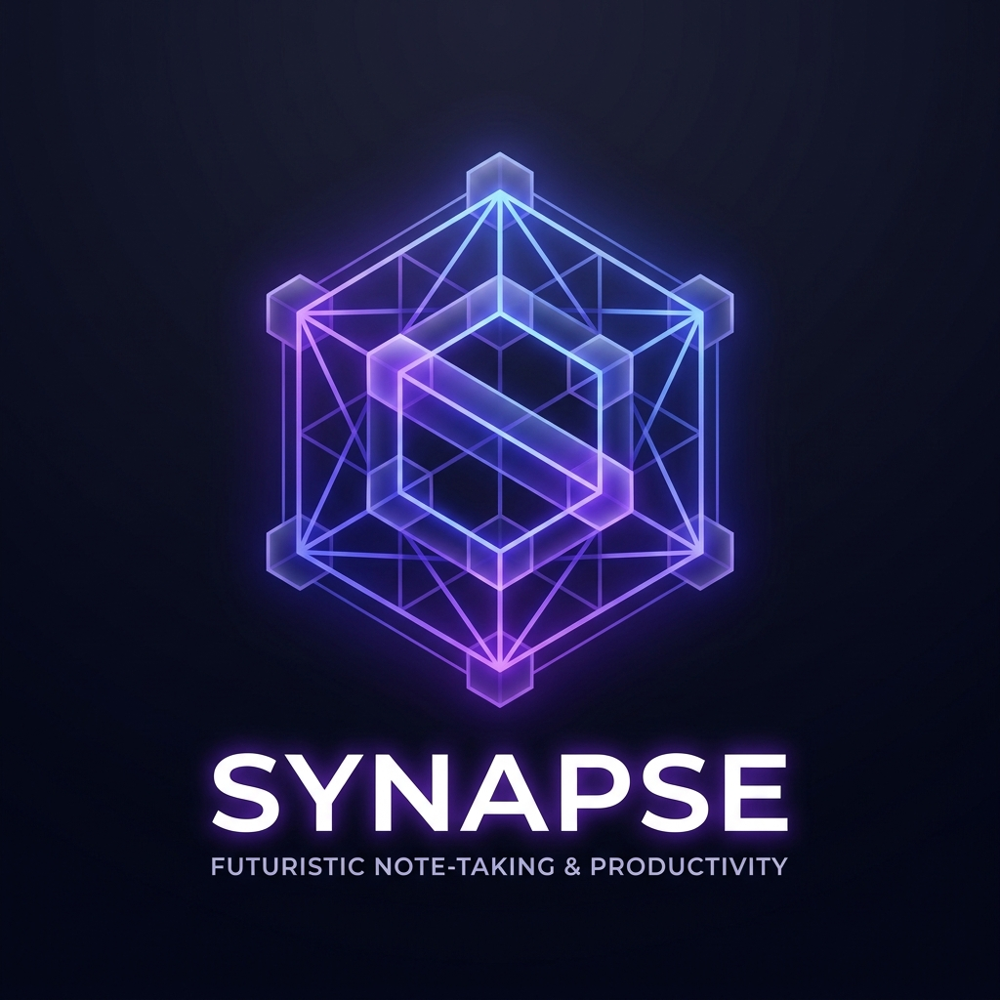

<div align="center">
  
  <h1>NoteMind — Offline-First Notes App</h1>
  <p>A powerful, privacy-first notes app with AI, real-time collaboration, and a beautiful UI.</p>

  <p>
    
    
    
    
    
  </p>
</div>

---

## ✨ Features

| Feature | Description |
|---|---|
| 📝 **Rich Text Editor** | Powered by BlockNote — headings, lists, images, code blocks |
| 🔗 **Wikilinks** | Type `[[Note Title]]` to link notes together |
| 🌐 **Knowledge Graph** | Visualize all your notes as an interactive 3D graph |
| 🤖 **AI Assistant** | Summarize, fix grammar, continue writing, translate — powered by Gemini |
| 🎙️ **Voice Notes** | Dictate your notes with speech recognition |
| 📡 **Real-time Collaboration** | Live multiplayer editing via WebRTC (yjs) |
| 💾 **Offline First** | Works fully offline; syncs when back online (Dexie + IndexedDB) |
| 🕰️ **Time Travel** | Restore any previous version of a note |
| 🏷️ **Tags** | Organize notes with tags and filter by them |
| 🔐 **Google OAuth** | Sign in securely with your Google account |
| 🌙 **Dark Mode** | Sleek dark UI with note color themes |
| 🖼️ **Export** | Export notes as Markdown or plain text |

---

## 🚀 Getting Started (Local Development)

### 1. Clone the repo

```bash
git clone https://github.com/Piyushsuiii/offline-first-notes-app.git
cd offline-first-notes-app
```

### 2. Install dependencies

```bash
npm install
```

### 3. Set up environment variables

```bash
# Copy the example file
cp .env.example .env.local
```

Now open `.env.local` and fill in your values:

| Variable | Where to get it |
|---|---|
| `AUTH_SECRET` | Run `openssl rand -hex 32` or use any 32-char random string |
| `AUTH_GOOGLE_ID` | [Google Cloud Console](https://console.cloud.google.com) → APIs & Services → Credentials |
| `AUTH_GOOGLE_SECRET` | Same as above |
| `DATABASE_URL` | Supabase project → Settings → Database → Connection string (Transaction mode, port 6543) |
| `DIRECT_URL` | Supabase project → Settings → Database → Connection string (Session mode, port 5432) |
| `GOOGLE_GENERATIVE_AI_API_KEY` | [Google AI Studio](https://aistudio.google.com) → Get API Key |

### 4. Run database migrations

```bash
npx prisma migrate deploy
```

### 5. Start the dev server

```bash
npm run dev
```

Open [http://localhost:3000](http://localhost:3000) in your browser.

---

## 🛠️ Tech Stack

| Layer | Technology |
|---|---|
| **Framework** | [Next.js 16](https://nextjs.org) (App Router) |
| **Language** | TypeScript 5 |
| **Styling** | Tailwind CSS v4 |
| **Editor** | [BlockNote](https://www.blocknotejs.org) |
| **Offline Storage** | [Dexie](https://dexie.org) (IndexedDB wrapper) |
| **Sync / Collab** | [Yjs](https://yjs.dev) + y-webrtc + y-indexeddb |
| **Auth** | [NextAuth v5](https://authjs.dev) with Google provider |
| **Database** | [Supabase](https://supabase.com) (PostgreSQL via Prisma) |
| **AI** | [Google Gemini](https://ai.google.dev) via AI SDK |
| **Graph** | [react-force-graph-3d](https://github.com/vasturiano/react-force-graph) + Three.js |
| **State** | [Zustand](https://zustand-demo.pmnd.rs) |
| **UI Components** | shadcn/ui + Lucide React |

---

## 🌐 Deploying to Vercel

### Quick Deploy

```bash
npm i -g vercel
vercel --prod
```

### Environment Variables on Vercel

Go to **Vercel Dashboard → Project → Settings → Environment Variables** and add all the variables from your `.env.local`.

> ⚠️ **Important:** Set `AUTH_URL` and `NEXT_PUBLIC_APP_URL` to your Vercel production URL (not localhost).

### Google OAuth Setup

In [Google Cloud Console](https://console.cloud.google.com):
1. Go to **APIs & Services → Credentials → Your OAuth Client**
2. Add to **Authorized redirect URIs**:
   ```
   https://YOUR-VERCEL-URL.vercel.app/api/auth/callback/google
   ```

---

## 📁 Project Structure

```
src/
├── app/
│   ├── page.tsx              # Landing page
│   ├── app/page.tsx          # Main notes app
│   └── api/
│       ├── ai/completion/    # Gemini AI streaming endpoint
│       └── auth/[...nextauth]/ # Auth routes
├── components/
│   ├── editor.tsx            # Main BlockNote editor
│   ├── sidebar.tsx           # Notes list sidebar
│   ├── graph-view.tsx        # 3D knowledge graph
│   ├── chat-sidebar.tsx      # AI chat panel
│   └── ...                   # Other UI components
├── lib/
│   ├── db.ts                 # Dexie database schema
│   ├── dbServices.ts         # DB helper functions
│   └── ai/embeddings.worker.ts # Web Worker for embeddings
└── store/
    └── useStore.ts           # Zustand global state
```

---

## 📝 License

MIT — feel free to use, fork, and build on top of this!

---

<div align="center">
  Made with ❤️ by <a href="https://github.com/Piyushsuiii">Piyushsuiii</a>
</div>
